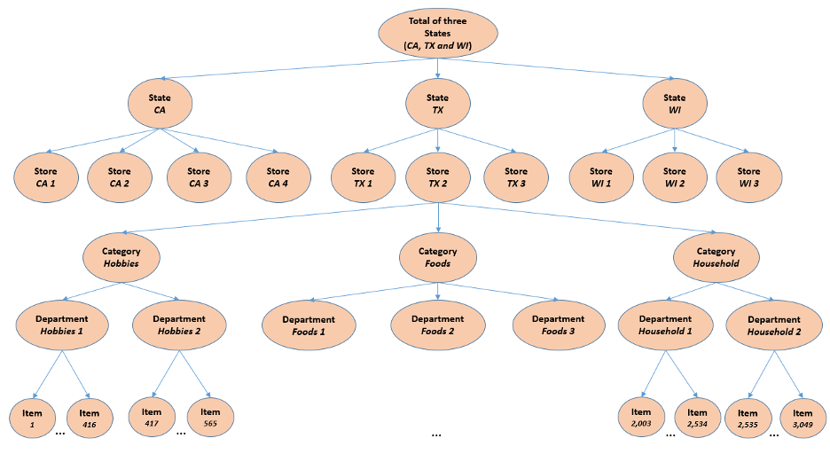

# データセット

ウォルマート社から提供されたM5データセットは，米国で販売された様々な商品の販売台数を時系列でグループ化したものである。具体的には、3つの商品カテゴリー（趣味、食品、家庭用品）と7つの商品部門に分類された3,049点の商品の販売個数を集計しています。商品は、3つの州（CA、TX、WI）にある10店舗で販売されています。この点では、階層の最下層、すなわち商品-店舗間の売上高は、以下のように、商品カテゴリーと地域のいずれかにマッピングすることができます。

| レベル | ID 集計レベル | シリーズ数 |
| ---- | ---- | ---- |
| 1 | 全商品の販売台数、全店・全州集計 | 1 |
| 2 | 全商品の販売台数、州別集計 | 3 |
| 3 | 全商品の販売台数、店舗別集計 | 10 |
| 4 | 全商品の販売台数、類別集計 | 3 |
| 5 | 全商品の販売台数、部署別集計 | 7 |
| 6 | 全商品の販売台数、各州とカテゴリーごとに集計 | 9 |
| 7 | 全商品の販売台数、各州・省庁の集計 | 21 |
| 8 | 全商品の販売台数、店舗別集計 | 30 |
| 9 | 全商品の販売台数、店舗部門別集計 | 70 |
| 10 | 製品の販売台数×、全店・全州集計 | 3,049 |
| 11 | 製品の販売台数×、州別集計 | 9,147 |
| 12 | 製品の販売台数×、店舗別集計 | 30,490 |

過去のデータは2011-01-29から2016-06-19までです。したがって、商品の（最大）販売履歴は1,9412日/5.4年となります（h=28日のテストデータは含まれていません）。

M5データセットは、以下の3つのファイルで構成されています。

## ファイル 1: "calendar.csv"
商品の販売日に関する情報が含まれています。
- "date". 日付を "y-m-d "形式で表示します。
- "wm_yr_wk". 日付が属する週のID。
- "weekday": "平日"。曜日の種類（土曜日、日曜日、...、金曜日）。
- "wday": 日付の属する曜日のID。
- "month": 日付の属する月。
- "year": 日付の年。
- "event_name_1". 日付にイベントが含まれている場合、このイベントの名前。
- "event_type_1": 日付にイベントが含まれている場合、このイベントの種類。
- "event_name_2": 日付に2番目のイベントが含まれている場合、このイベントの名前。
- "event_type_2": 日付に2番目のイベントが含まれている場合、このイベントの種類。
- "snap_CA、snap_TX、snap_W "I: CAの店舗があるかどうかを示すバイナリ変数（0または1）。 TX または WI は調査日に SNAP3 の購入を許可している。1 は SNAP 購入が許可されていることを示しています。

## ファイル 2: "sell_prices.csv"
店舗ごとに販売された商品の価格と日付の情報が含まれています。
- "store_id": 商品を販売している店舗のID。
- "item_id": 商品のIDです。
- "wm_yr_wk": 商品のIDです。
- "sell_price": 指定された週/店舗の商品価格です。価格は週ごとに提供されます。 7 日間の平均）。利用できない場合は、調査した週にその商品が販売されていないことを意味する。価格は週単位では一定ですが、時間の経過とともに変化する可能性があることに注意してください（トレーニングセットとテストセットの両方）。

## ファイル 3: "sales_train.csv"
商品・店舗ごとの過去の1日の販売台数データが含まれています。
- "item_id": 商品のID。
- "DEPT_ID": 商品が所属する部署のID。
- "cat_id": 製品が属するカテゴリのID。
- "store_id": 製品が販売されている店舗のID。
- "state_id": 商品が販売されている州です。
- "d_1, d_2, ..., d_i, ... d_1941": 2011-01-29から始まるi日目の販売個数。