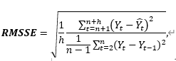
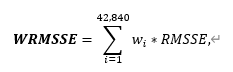
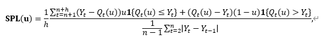
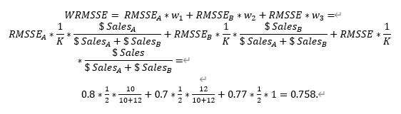

# 評価
## forecasting horizon
必要とされる予測の数は、ポイント予測と確率予測の両方で、**h=28日(4週間先)**です。

パフォーマンス指標は、最初に各系列ごとに別々に計算され、予測期間についてそれらの値を平均化し、その後、系列について平均化して、最終的なスコアが得られます（下記参照）。
## ポイント予測
ポイント予測の精度は、Hyndman and Koehler (2006)によって提案された有名なMean Absolute Scaled Error (MASE)の変種であるRoot Mean Squared Scaled Error (RMSSE)を用いて評価されます。この評価は、各系列について以下のように計算されます。 
 
ここで、Y_tは時点tにおける調査された時系列の実際の将来値、hat(Y_t)̂生成された予測、nは学習サンプルの長さ(過去の観測数)、hは予測期間です。 
RMSSEの分母は、調査対象の商品が活発に販売されている期間、すなわち、評価対象の系列で観測された最初の非ゼロの需要に続く期間についてのみ計算されることに注意してください。  

評価は、以下のような理由で定められました。
- M5系列の特徴は、ゼロの多い散発的な販売台数を伴う断続性です。このため、中央値に最適化された絶対誤差は、ゼロに近い予測を導き出す予測手法の方がスコアが低い（パフォーマンスが良い）ということになる。しかし、M5の目的は平均的な需要を正確に予測することであり、そのために使用される精度指標は平均値に最適化された二乗誤差に基づいている。
- この尺度は尺度に依存しないので、異なる尺度で系列間の予測を比較するために効果的に使用することができることを意味します。
- 他の尺度とは対照的に、それは等しいかゼロに近い値を持つ除算に依存しないので、安全に計算できる（例えば、Y_t=0のときのパーセンテージ誤差や、スケーリングに使用されるベンチマークの誤差がゼロのときの相対誤差で行われるように）。
- この評価は、正の予測誤差、負の予測誤差、および大小の予測を等しく罰するため、対称性があります。

ここで w_i はcompetitionの i番目の系列の重みです。WRMSSE スコアは低いほどよいです。 
各系列の重みは、データセットのトレーニングサンプルの最後の28個のovservationに基づいて計算されることに注意してください。WRMSSEを計算するためのコード例は、競技の[GitHubリポジトリ](https://github.com/Mcompetitions)で公開されます。

## 確率予測
確率予測の精度は、尺度化されたピンボール損失（SPL）関数を使用して評価されます。この尺度は、以下のように各シリーズと分位数ごとに計算されます。

ここで、Y_t は点tにおける調査された時系列の実際の将来値、Q_t (u) は分位値uについて生成された予測値、h は予測期間、n は訓練標本の長さ（過去のオブザベーションの数）、1 は指標関数(Y が想定された区間内にある場合は1、そうでない場合は0)です。 
RMSSEと同様に、SPLの分母は、調査対象の商品が活発に販売されている期間、すなわち、評価対象のシリーズで観測された最初のゼロ以外の需要の後の期間についてのみ計算されます。 
中央値、50%, 67%, 95%, 99% PIを求めるべきなので、分位値uはu1=0.005, u2=0.025, u3=0.165, u4=0.25, u5=0.5, u6=0.75, u7=0.835, u8=0.975, u9=0.995と設定されています。uの小さい値は分布の左側に対応し、高い値は分布の右側に対応し、u = 0.5を中央値とします。中央値、50%と67%のPIは、分布の中央値の良い予測を提供し、95%と99%のPIは、非常に高いまたは非常に低いアウトカムのリスクの観点から重要な、その尾部に関する情報を提供します。 
競技会のすべての42840の時系列と要求されたすべての分位値についてSPLを推定した後、本ガイドで後述する加重SPL(WSPL)を用いて、以下の式を用いて`participating methods`を9で割って順位付けします(全系列にわたる9つの分位数の平均的な性能)。 

ここで w_i はcompetitionの i 番目の系列の重みで、u_j は調査された分位値のうち j 番目の系列の重みです。WSPL のスコアは低いほどよいです。

評価は、以下のような理由で定められました。
- PLはRMSSEと同様の方法で尺度化されており、異なる尺度を持つ系列間の予測を比較するために効果的に使用することができます。さらに、SPLは、ゼロに等しい値を持つ除算に依存しないので、安全に計算できます。
- M5は、特定の意思決定問題に焦点を当てておらず、そのような問題の正確なパラメータも定義していないので（これは、異なる集約レベルや系列に対しても変化しうる）、すべてのクオンタイルが潜在的に有用である可能性があることが明らかになります。 さらに、M5の目的は、調査された系列の実現値の不確実性分布を可能な限り正確に推定することであるため、分布の両側と両端が関連していると考えられます。この点では，調査されたクオンタイルには特別な重みが割り当てられておらず，したがって，均等に重み付けされている．

繰り返しになりますが、各シリーズの重みは、データセットのトレーニングサンプルの最後の28個の観測に基づいて計算され、すなわち、各シリーズが特定の期間に表示された累積実際のドル売上高（販売されたユニットの合計にそれぞれの価格を掛けたもの）に基づいて計算されることに注意してください。WSPLを計算するためのコードは、競技のGitHubリポジトリで公開されています。

## 重み付け

これまでのM競争とは対照的に、M5では、販売数量と価格が異なる様々な製品の販売単位が階層的に整理されています。つまり、ビジネス的には、ある手法が優れたパフォーマンスを発揮するためには、すべての階層にわたって正確な予測を提供する必要があり、特に重要度の高いシリーズ、すなわち米ドルで測定された大きな売上を示すシリーズについては、正確な予測を提供しなければならないということである。言い換えれば、最もパフォーマンスの高い予測手法には、会社にとってより価値のあるシリーズの予測誤差がより低くなることを期待しています。 

そのために、各参加手法（RMSSEとSPLの両方）について計算された予測誤差は、それらの累積実際のドル売上高に基づいて、M5シリーズ全体で重み付けされます。累積ドル売上高は、トレーニング・サンプルの最後の28の観測（販売されたユニットの合計にそれぞれの価格を乗算したもの）、すなわち予測期間に等しい期間を使って計算されます。販売されているユニット数とそれぞれの価格は時間の経過とともに変化するので、この推定は、対応する毎日のドル売上高の合計に基づいていることに注意してください。 

以下に、これらの重みがどのように計算されるかについて、シンプルでありながらも示唆に富んだ例を示します。 

WIの店舗で同じ部門の2つの商品AとBが販売されていると仮定し、これらの2つの商品の販売台数とその集計値を予測することに関心がある。そこで、この例では、2つの異なる集計レベル（K=2）、2つの系列（系列Aと系列B）からなる第1のレベルと、1つの系列（系列Aと系列Bの合計）からなる第2のレベルを考えます。 

予測手法を用いて，製品Aと製品Bの合計売上高を点予測したとすると，誤差はそれぞれRMSSEA=0.8，RMSSEB=0.7，RMSSE=0.77であった。もしM5のデータセットがこの3つの系列だけであれば，この手法の最終的なWRMSSEスコアは次のようになる。 

この重み付けスキームは、前述したように、より多くの店舗、地域、商品カテゴリー、商品部門を考慮するために拡張することができる。M5 の競争には 12 の集計レベルがあるので、K は 12 に設定され、各集計レベルで 1 になるように系列の重みが計算されます。 

逆に、上記式でWRMSSEの推定に用いたRMSSEをSPLに置き換えることで、WSPLを算出することができる。 

すべての集計レベルが等しく重み付けされていることに注意してください。その理由は、3つの州すべてで測定された製品の総ドル売上高が、10店舗すべてで測定された場合、この製品のドル売上高の合計と等しいからである。同様に、ある店舗の商品カテゴリーのドル売上高の合計は、このカテゴリーが構成する部門のドル売上高の合計と、対応する部門の商品のドル売上高の合計とが等しくなるからである。また、確率的予測の場合について前述したように、M5は、特定の意思決定問題に焦点を当てていないので、階層の個々のレベルを不均等に重み付けする理由はありません。 

WRMSSE と WSPL を計算するためのコード例は、競争の GitHub リポジトリで公開され、競争における各系列の正確な重みを示します。
