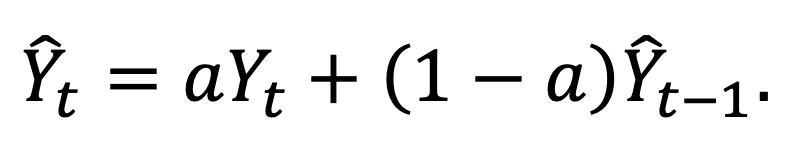

# ベンチマーク
M4コンペティションと同様に、ベンチマークとなる手法が用意されており、点予測では24の手法が、確率予測では6の手法が用意されている。これらの手法はよく知られており、すぐに利用可能で、適用が容易であるため、M5 コンペに提出される新しい手法の精度は、実際に検討され、使用されるためには、より優れた精度を提供しなければならない（計算要件が最小限のベンチマークと比較して、より正確な手法を使用するために必要な計算時間も考慮に入れて）。

## ポイント予測
### 統計的ベンチマーク
1. "Naive":  以下のように定義されたランダムウォークモデル

予測法では、階層の最下層（表1のレベル12）の系列を予測し、ボトムアップ法で調整する。

2. "Seasonal Naive (sNaive)": Naive と同様であるが，今回は週ごとの季節変動の可能性を捕捉するために，モデルの予測は同じ期間の最後の既知の観測に等しい．予測法は、階層の最下層（表1のレベル12）の系列を予測し、ボトムアップ法で調整を行う。

3. "Simple Exponential Smoothing (SES)":最も単純な指数平滑化モデルで、トレンドのない系列を予測することを目的としており、以下のように定義されています。

平滑化パラメータaはモデルのインサンプル平均二乗誤差(MSE)を最小化して[0.1, 0.3]の範囲から選択し、系列の最初の観測を初期化に用いる。予測法では、階層の最下層（表1のレベル12）の系列を予測し、ボトムアップ法で再調整を行います。

4. Moving Averages (MA): 予測は，系列の最後のk個のオブザベーションを平均化することによって計算される．

ここで、kはインサンプルMSEを最小化して[2,5]の範囲から選択する。予測法では、階層の最下層（表1のレベル12）の系列を予測し、ボトムアップ法で再調整を行う。

5. Croston’s method (CRO): 間欠的な需要を示す系列を予測するためにCrostonが提案した手法。この手法では、元の系列をゼロではない需要規模 𝑧𝑡 と間欠需要間隔 𝑝𝑡 に分解し、以下のように予測を導出する。

ここで、𝑡 𝑧 と 𝑡 𝑝 の両方が SES を用いて予測される。両成分の平滑化パラメータは 0.1 に等しい値に設定されている。初期化には、各成分の最初の観測値を用いる。予測法では、階層の最下層（表1のレベル12）の系列を予測し、ボトムアップ法で調整を行う。

6.  Optimized Croston’s method (optCro): 6. 最適化クロストン法（optCro）：CRO と同様であるが、より柔軟性を持たせるために、今回は SES と同様に平滑化パラメータを [0.1, 0.3] の範囲から選択している。ゼロではない需要サイズと需要間の間隔は、（潜在的に）異なるaパラメータを使用して別々に平滑化される。予測法は、階層の最下層（表1のレベル12）の系列を予測するために使用され、その後、ボトムアップ法は、和解のために使用されます。

7. シンテートス・ボイラン近似(SBA). クロストン法の変形で、以下のようにデビアス因子を利用したもの。

予測法では、最下位階層（表1のレベル12）の系列を予測し、ボトムアップ法で調整する。

8. Teunter-Syntetos-Babai method (TSB): Croston の手法を修正したもので、需要間隔の成分を需要確率 𝑑𝑡 に置き換え、時刻 t に需要が発生した場合には 1、そうでない場合には 0 とする。Croston 法と同様に、𝑑𝑡 は SES を用いて予測される。𝑑𝑡 と 𝑡 𝑧 の平滑化パラメータは optCRO と全く同じように異なる場合がある。予測は以下のように与えられる。

予測法では、最下位階層（表1のレベル12）の系列を予測し、ボトムアップ法で調整する。

9. Aggregate-Disaggregate Intermittent Demand Approach (ADIDA): 時間的集約は、ゼロ・オブザベーションの存在を減少させるために使用され、したがって、間隔で観察された分散の望ましくない効果を緩和する。ADIDA は、重ならない時間的集約を実行し、事前に指定されたリードタイムにわたって需要を予測するために、等しく大きさの時間バケットを使用する。時間バケットは平均的な需要間隔に等しく設定されています。予測を得るためにSESが使用される。予測法は、階層の最下層（表１のレベル１２）の系列を予測し、ボトムアップ法で調整を行う。

10. Intermittent Multiple Aggregation Prediction Algorithm (iMAPA): 需要予測における時間的集約を実装するもう一つの方法である。ただし、単一の集約レベルを考慮する ADIDA とは対照的に、iMAPA は複数の集約レベルを考慮し、データの異なるダイナミクスを捉えることを目的としている。そこで、iMAPAでは、SESを用いて生成されたポイント予測を平均化していく。集計レベルの最大値は、最大需要間隔と同じに設定されています。予測方法は、階層の最下層（表1のレベル12）の系列を予測し、ボトムアップ法で調整を行う。

11. Exponential Smoothing - Top-Down (ES_td): 階層のトップレベル系列（表1のレベル1）を予測するために、最も適切な指数平滑化モデルを選択するためのアルゴリズムが使用されます。情報基準によって示されたものを使用しています。調整にはトップダウン方式を採用しています（過去28日分の過去の比率に基づき、過去28日分を推定）。

12. Exponential Smoothing – Bottom-Up (ES_bu): 情報基準を介して示される階層の最下層の系列（表１のレベル１２）を予測するために、最適な指数平滑化モデルを選択するためのアルゴリズムが使用される。予測法は、階層の最下位レベルの系列（表１のレベル１２）を予測するために使用され、その後、ボトムアップ法は、和解のために使用される。

13. Exponential Smoothing with eXplanatory variables (ESX): ESと似ていますが、今回は2つの説明変数をレグレッサーとして使用し、将来に関する追加情報を提供することで予測精度を向上させます。1 つ目の変数は離散変数で、調査日に SNAP の購入を許可している州の数に基づいて 0、1、2、または 3 の値をとります。2 番目の変数は 2 進数で、調査日に特別なイベントが含まれているか（1）、含まれていないか（0）を示します。調整にはトップダウン方式が用いられている（過去 28 日間に推定された過去の割合に基づく）。

14. AutoRegressive Integrated Moving Average - Top-Down (ARIMA_td):アルゴリズムは、情報基準によって示される階層の最上位系列（表 1 のレベル 1）を予測するために、最も適切な ARIMA モデルを選択するために使用されます。トップダウン法は、和解のために使用される（過去28日間に推定された過去の割合に基づく）。

15. AutoRegressive Integrated Moving Average – Bottom-Up (ARIMA_bu): 情報基準で示された階層のボトムレベル系列（表１のレベル１２）の予測に最適なＡＲＩＭＡモデルを選択するためのアルゴリズムが使用される。予測方法は、階層の最下層の系列（表１のレベル１２）を予測するために用いられ、その後、ボトムアップ方法は和解のために用いられる。

16.  AutoRegressive Integrated Moving Average with eXplanatory variables (ARIMAX): ARIMA と似ていますが、今回は ESX の場合と同様に、2 つの外部変数をレグレッサーとして使用し、将来に関する追加情報を提供することで予測精度を向上させています。調整にはトップダウン方式を採用しています（過去28日分の過去の比率に基づき、過去28日分を推定）。

## 機械学習のベンチマーク

17. Multi-Layer Perceptron (MLP): 14個の入力ノード（利用可能なデータの直近2週間分）、28個の隠れノード、1個の出力ノードからなる単一の隠れ層NN。重みの推定にはScaled Conjugate Gradient法を用い，最大反復回数は500回とした．隠れ層と出力層の活性化関数は、それぞれロジスティック層と線形層である。合計10個のMLPを訓練して各系列を予測し、中央値演算子を用いて個々の予測を平均化することで、重みの初期化が不十分であることによるばらつきを軽減しています。予測法は、階層の最下層（表1のレベル12）の系列を予測するために使用され、その後、ボトムアップ法は、和解のために使用されます。

18. Random Forest (RF): これは複数の回帰木の組み合わせで、それぞれが独立してサンプリングされた同じ分布を持つランダム・ベクトルの値に依存する。RFは複数の木の予測値を平均化するので、ノイズに強く、訓練データにオーバーフィットする可能性が低い。我々は、合計500本の非剪定木と、各分割でランダムにサンプリングされた4つの変数を考慮します。ブートストラップサンプリングは、置換を用いて行われます。MLPで行われるように，系列の最後の14個のオブザベーションがモデルの訓練のために考慮される．予測法は、階層の最下層（表1のレベル12）の系列を予測するために使用され、ボトムアップ法は、その後、和解のために使用される。

19. Global Multi-Layer Perceptron (GMLP): MLPと似ているが、今回は複数のモデルを各系列ごとに学習するのではなく、全系列に渡って学習する単一のモデルを構築する。これは、M4が交差学習の有益な効果を示したことを考慮して行われます。各系列の最後の14個のオブザベーションが、非ゼロ要求の変動係数(CV2)と2つの連続する非ゼロ要求の間の平均時間周期数(ADI)に関する情報とともに、入力として使用されます。この追加情報は、一連の異なる特性の間の学習を促進するために使用される。予測法は、階層の最下層（表１のレベル１２）の系列を予測するために使用され、その後、ボトムアップ法は、和解のために使用される。

20. Global Random Forest (GRF): GMLP と同様であるが、予測値を得るために MLP を使用する代わりに RF を利用する。予測手法は、階層の最下層（表1のレベル12）の系列を予測し、ボトムアップ法で調整する。

## コンビネーションベンチマーク

21. Average of ES and ARIMA, as computed using the bottom-up approach (Com_b): 単純な
ES_buとARIMA_buの算術平均。

22.  Average of ES and ARIMA, as computed using the top-down approach (Com_t): ES_td と ARIMA_td の単純算術平均。

23. Average of the two ES methods, the first computed using the top-down approach and the second using the bottom-up approach (Com_tb): ES_td と ES_bu の単純平均値。

24. Average of the global and local MLPs (Com_lg): MLP と GMLP の単純算術平均。その後、ボトムアップ法を用いて和解を行う。

ベンチマーク法{1-10, 12, 15, 17-20}は、階層構造化されたデータセットの製品-店舗レベルで適用されていることに注目してください。このように、ボトムアップ法は、残りの階層レベルの再調整された予測を得るために使用される。一方、ベンチマーク法{11, 13, 14, 16}は、階層構造化されたデータセットのトップレベルで適用される。このように、トップダウン法は、残りの階層の予測を得るために使用される（過去28日間に推定された過去の割合に基づく）。

## 確率的予測

1. Naive: 点予測の計算に使用される Naive 1 と同様の実装。

2. Seasonal Naive (sNaive): ポイント予測の計算に使用されるsNaiveと同様の実装。

3. Simple Exponential Smoothing (SES): ポイント予測の計算に使用されるSESと同様の実装。

4. Exponential Smoothing (ES): ポイント予測の計算に使用されるES_buの実装に似ています。

5. AutoRegressive Integrated Moving Average (ARIMA): ポイント予測の計算に使用される ARIMA_bu と同様の実装。

6. Kerner density estimate (Kernel): カーネルを用いて、過去のデータの対応する数 値を推定し、それを確率的予測として使用する。

上記ベンチマークの予測を生成するコードは、本コンテストのGitHubリポジトリで公開されます。
ベンチマークは賞品の対象にはなりません。つまり、ベンチマークが参加者によって提出された予測よりも良い結果を出したとしても、その総額が参加者の間で分配されることを意味します。同様に、主催者とデータ提供者に関連する参加方法は、価格の対象外となります。